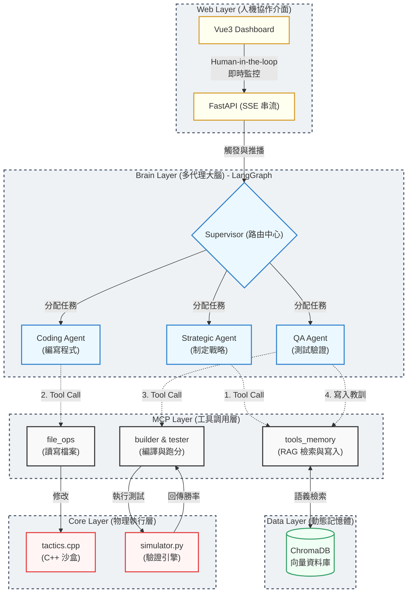

# Akagi Mahjong Core - 系統架構圖

這張圖展示了專案的 4 大核心分層與資料流向。您可以直接將此圖截圖放入您的簡報中，或是將下方的 Mermaid 程式碼貼到 [Mermaid Live Editor](https://mermaid.live/) 或 [Draw.io](https://app.diagrams.net/) 進行二次修改。

## 報告時的解說重點 (搭配此圖)：

1. **由上而下 (Web -> Brain)**：提到這是一個有前端 UI 監控的系統，人類下達指令給 FastAPI 後，交給大腦層的 Supervisor 進行任務路由。
2. **中間協作 (Brain -> MCP)**：強調 LangGraph 確保了流程的可控性，三個 Agent 職責分明，不會越權。他們必須透過 MCP Layer (Model Context Protocol) 提供的工具才能對外操作。
3. **左側循環 (Strategic <-> Data)**：展示您的 **RAG 記憶庫能力**。戰略 Agent 修改前會先去 ChromaDB 檢索歷史失敗紀錄。
4. **右側循環 (QA <-> Core <-> Data)**：展示 **Tool-use 能力與閉環**。Agent 去修改 C++ Sandbox 代碼，QA 編譯跑分後，將成功/失敗的經驗寫回 ChromaDB，完成「自我進化」。
